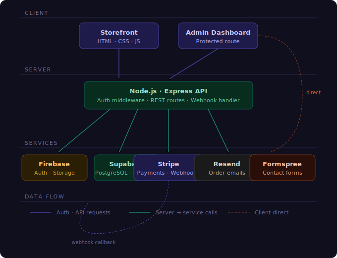

# ✨ AETHERIC — Luxury E-Commerce Platform 🛍️

  

✨ Luxury Curation • 🔐 Encrypted Payments • 📧 Instant Confirmation

----
## 📋 Overview

**AETHERIC** is a production-grade full-stack luxury e-commerce platform built for high-end retail. It delivers a seamless shopping experience — from product discovery and cart management to secure checkout and branded order confirmation emails — all wrapped in an editorial luxury aesthetic.

## ✨ features
----------
## 🛍️ Customers
----
- 🔍 Browse and filter a curated product catalog
- 🛒 Manage a persistent cart across sessions
- 💳 Checkout securely via Stripe-powered payments
- 📧 Receive branded HTML order confirmation emails instantly
- ❤️ Save favourite products and revisit them anytime
- 📊 Access a personal dashboard to track orders and purchase history
- 💸 Monitor spending and analyse expenses over time
------
## 🏪 Store owner
-----
🏪 Store owners can:
- 📌 List, update, and manage product inventory
- 📦 Track and fulfill orders in real time
- 💰 Monitor revenue and analytics via a protected admin dashboard
- 👤 Look up customer order history and manage order statuses

-----
## 🛠️ Tech Stack

  
  
  
  
  
  
  

-----
## 🏗️ Architecture

---

> 🧠 **3-Tier Design** — Client · Server · Services — every layer has one job.

🖥️ **Client** (HTML/CSS/JS) never touches any database or payment provider directly — every sensitive operation routes through the Express server first.

🛡️ **Express** acts as the central gatekeeper — every incoming request hits a Firebase Auth middleware that verifies the JWT token before any route logic executes.

🔀 **Once authenticated**, the server fans out to the right service — Supabase for database reads/writes, Stripe for payment intents and refunds, and Resend for branded order confirmation emails.

🔔 **Stripe webhooks** call back into the server to confirm payment server-side — order status is never trusted from the client alone.

⚡ **Formspree** is the only bypass — contact forms POST directly from the browser since no sensitive data is involved and no server overhead is needed.

------

  

------
